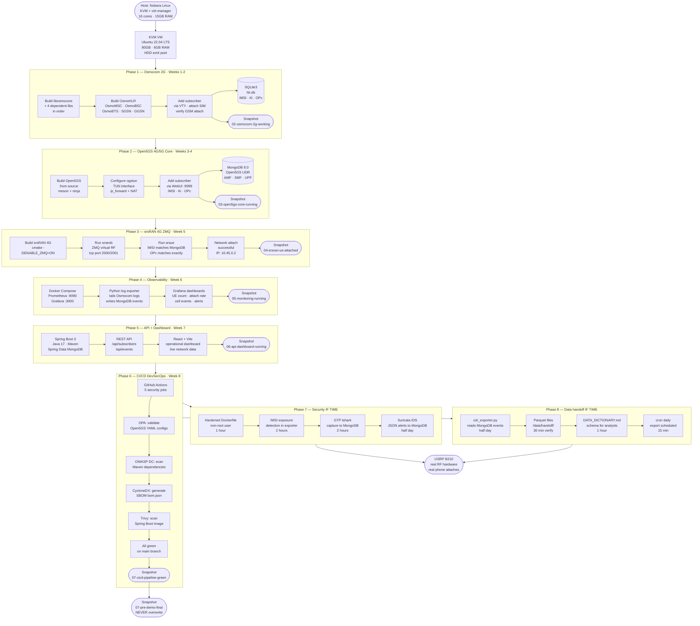

# Private Cellular Network Lab
### Graduation Project — Full-Stack 2G / 4G / 5G Implementation

> A complete private mobile network built from open-source telecom software — 2G GSM/GPRS,
> 4G EPC, and 5G SA core — with a Java API, React dashboard, Prometheus monitoring,
> DevSecOps CI/CD pipeline, network IDS, and a CDR data engineering layer.
> Runs on a single KVM VM on commodity hardware.

---

## Table of Contents

1. [Project Overview](#1-project-overview)
2. [Project Workflow](#2-project-workflow)
3. [Full Architecture](#3-full-architecture)
4. [Technology Stack](#4-technology-stack)
5. [Known Failure Points and Mitigations](#5-known-failure-points-and-mitigations)
6. [Host Machine Setup](#6-host-machine-setup)
7. [KVM Virtual Machine Setup](#7-kvm-virtual-machine-setup)
8. [Phase 1 — Osmocom 2G GSM/GPRS](#8-phase-1--osmocom-2g-gsmgprs)
9. [Phase 2 — Open5GS 4G/5G Core](#9-phase-2--open5gs-4g5g-core)
10. [Phase 3 — srsRAN 4G Radio Access Network](#10-phase-3--srsran-4g-radio-access-network)
11. [Phase 4 — Observability Layer](#11-phase-4--observability-layer)
12. [Phase 5 — Spring Boot API + React Dashboard](#12-phase-5--spring-boot-api--react-dashboard)
13. [Phase 6 — CI/CD + DevSecOps Pipeline](#13-phase-6--cicd--devsecops-pipeline)
14. [Phase 7 — Security Layer (if time)](#14-phase-7--security-layer-if-time)
15. [Phase 8 — Data Preparation Handoff (if time)](#15-phase-8--data-preparation-handoff-if-time)
16. [Honest Stack Assessment](#16-honest-stack-assessment)
17. [Database Architecture](#17-database-architecture)
18. [Telecom Protocol Security Awareness](#18-telecom-protocol-security-awareness)
19. [Regulatory Awareness — Egypt](#19-regulatory-awareness--egypt)
20. [RAM and Storage Strategy](#20-ram-and-storage-strategy)
21. [Snapshot Strategy](#21-snapshot-strategy)
22. [Demo Guide](#22-demo-guide)
23. [Project Roadmap](#23-project-roadmap)

---

## 1. Project Overview

This project builds a fully functional private cellular network spanning three generations of
mobile technology using exclusively open-source software. It is unique as a graduation project
because the three core components (Osmocom, Open5GS, srsRAN) have each been used
individually in research labs — combining all three with a full modern software stack on top
has not been done as a student project before.

### What the project demonstrates

- Working 2G GSM/GPRS network — Osmocom stack, SQLite3 HLR, virtual BTS simulation
- Working 4G EPC core — Open5GS, MongoDB subscriber store, srsRAN 4G ZMQ UE simulation
- Optional 5G SA path — Open5GS 5G core with OCUDU gNB (if time, after 4G confirmed)
- Real-time observability — Prometheus metrics, Grafana dashboards, Python log exporter
- Java Spring Boot REST API for subscriber and event management backed by MongoDB
- React + Vite operational dashboard consuming live network data
- GitHub Actions CI/CD with 5 focused security gates producing concrete artifacts
- Optional: Suricata IDS, GTP monitoring, IMSI exposure detection
- Optional: CDR data preparation handoff — typed Parquet files, data dictionary, cron export

### The OsmoHLR and SQLite3 architectural constraint

OsmoHLR is hardcoded to SQLite3 at the C source level. It uses SQLite-specific pragmas
(`PRAGMA journal_mode=WAL`, `PRAGMA synchronous=NORMAL`), raw `sqlite3_*` C API calls,
and queries against `sqlite_master`. There is no PostgreSQL support and no compile flag to
enable it. This is a deliberate design decision aligned with Osmocom's distributed edge
philosophy. The correct database for OsmoHLR is SQLite3 — this is not a limitation of the
project, it is an informed architectural choice.

---

## 2. Project Workflow

The diagram below shows the complete project from infrastructure setup through all eight
phases. Phases 1-6 are the required graduation project. Phases 7-8 are extensions if time
permits. Read top to bottom — each phase depends on the one above it being snapshotted
and verified.



---

## 3. Full Architecture

```
┌───────────────────────────────────────────────────────────────────┐
│                   KVM VM — Ubuntu 22.04 LTS                       │
│                                                                   │
│  ┌──────────────────┐      ┌───────────────────────────────────┐  │
│  │  Osmocom 2G      │      │  srsRAN 4G                        │  │
│  │  OsmoBTS (virt)  │      │  srsenb (eNodeB) + srsUE          │  │
│  │  OsmoBSC         │      │  ZMQ virtual RF · B210 later      │  │
│  │  OsmoMSC         │      └──────────────┬────────────────────┘  │
│  │  OsmoSGSN        │                     │                       │
│  │  OsmoGGSN        │                     ▼                       │
│  └────────┬─────────┘      ┌───────────────────────────────────┐  │
│           │                │  Open5GS 4G EPC / 5G SA Core      │  │
│           ▼                │  AMF · SMF · UPF · UDM · NRF      │  │
│  ┌──────────────────┐      └──────────────┬────────────────────┘  │
│  │  OsmoHLR         │                     │                       │
│  │  SQLite3 hlr.db  │                     ▼                       │
│  │  IMSI·Ki·OPc     │      ┌───────────────────────────────────┐  │
│  └──────────────────┘      │  MongoDB 8.0 (local)              │  │
│                             │  Open5GS UDR · NRF · PCF          │  │
│                             └──────────────┬────────────────────┘  │
│                                            │                       │
│  ┌─────────────────────────────────────────▼───────────────────┐  │
│  │  Observability — Docker Compose                             │  │
│  │  Prometheus :9090  ←  Open5GS metrics + Spring Actuator     │  │
│  │  Grafana :3000     ←  dashboards: UE count · events · GTP   │  │
│  │  Python exporter   →  MongoDB telecom_analytics collection   │  │
│  └─────────────────────────────────────────────────────────────┘  │
│                                                                   │
│  ┌─────────────────────────────────────────────────────────────┐  │
│  │  Application Layer                                          │  │
│  │  Spring Boot 3 API :8080  ←→  MongoDB                       │  │
│  │  React + Vite :5173       ←   Spring Boot API               │  │
│  └─────────────────────────────────────────────────────────────┘  │
│                                                                   │
│  ┌─────────────────────────────────────────────────────────────┐  │
│  │  Data Engineering (if time) — Docker Compose                │  │
│  │  CDR Generator → Parquet /data/raw/                         │  │
│  │  cdr_exporter.py → /data/handoff/ Parquet files              │  │
│  │  DATA_DICTIONARY.md — analyst handoff document               │  │
│  └─────────────────────────────────────────────────────────────┘  │
│                                                                   │
│  ┌─────────────────────────────────────────────────────────────┐  │
│  │  Security (if time)                                         │  │
│  │  Suricata IDS → /var/log/suricata/eve.json → MongoDB        │  │
│  │  tshark GTP capture → MongoDB gtp_events                    │  │
│  └─────────────────────────────────────────────────────────────┘  │
└───────────────────────────────────────────────────────────────────┘
          hosted on
┌─────────────────────────────────────────┐
│  Nobara Linux — Lenovo Legion 5         │
│  AMD Ryzen · 16 cores · 15GB RAM        │
│  KVM + virt-manager — type-1 hypervisor │
│  VM disk: HDD ext4 /mnt/kvm-storage     │
└─────────────────────────────────────────┘

GitHub repository
├── .github/workflows/    ← 5-job DevSecOps pipeline
├── config/osmocom/       ← .cfg files (OPA validates these)
├── config/open5gs/       ← .yml files (OPA validates these)
├── monitoring/           ← docker-compose.yml · prometheus.yml
├── exporter/             ← log_exporter.py · cdr_generator.py
├── policy/               ← open5gs_policy.rego
├── telecom-api/          ← Spring Boot Maven project
└── telecom-dashboard/    ← React + Vite project
```

---

## 4. Technology Stack

### Core telecom

| Component | Software | Role |
|---|---|---|
| 2G base station | OsmoBTS virtual | GSM radio layer simulation |
| 2G controller | OsmoBSC | Base station controller |
| 2G switching | OsmoMSC | Circuit-switched core |
| 2G subscriber DB | OsmoHLR + SQLite3 | HLR — hardcoded to SQLite3 |
| GPRS core | OsmoSGSN + OsmoGGSN | Packet data plane |
| 4G/5G core | Open5GS | EPC (4G) + 5G SA core |
| 4G RAN | srsRAN 4G | eNodeB + srsUE over ZMQ |
| 5G RAN (if time) | OCUDU | gNB — replaces archived srsRAN Project |

> **Critical:** srsRAN Project (5G) repo is archived as of February 17, 2026.
> Use srsRAN_4G for the confirmed ZMQ simulation path.
> Only use OCUDU for 5G gNB if 4G is fully working first.

### Databases

| Database | Used by | Why |
|---|---|---|
| SQLite3 | OsmoHLR exclusively | Hardcoded C API — WAL mode — no alternative |
| MongoDB 8.0 | Open5GS natively | Required by Open5GS UDR/NRF/PCF |
| MongoDB 8.0 | Analytics collection | Network events from Python exporter |
| Prometheus TSDB | Prometheus | Time-series metrics store |
| Parquet files (if time) | cdr_exporter.py | CDR handoff for analysts — /data/handoff/ |

### Application layer

| Component | Technology | Purpose |
|---|---|---|
| REST API | Java 21 + Spring Boot 3.3 | Subscriber CRUD · session queries |
| Metrics endpoint | Spring Actuator + Micrometer | Feeds Prometheus scraper |
| Log exporter | Python 3 · ~60 lines | Tails Osmocom logs → MongoDB events |
| CDR generator (if time) | Python 3 · pyarrow | Raw logs → typed Parquet CDR files |
| Frontend | React + Vite | Operational monitoring dashboard |
| Monitoring | Prometheus + Grafana | Docker Compose · metrics dashboards |

### CI/CD DevSecOps — 5 focused jobs, all free

| Job | Tool | What it produces |
|---|---|---|
| Config validation | Python yaml.safe_load | Catches broken Open5GS YAML before deploy |
| Policy-as-code | OPA standalone | Validates Open5GS configs against telecom rules |
| Dependency scan | OWASP Dependency Check | HTML/JSON CVE report for Spring Boot deps |
| SBOM generation | CycloneDX Maven plugin | `bom.json` — software bill of materials |
| Container scan | Trivy | Vulnerability table for Spring Boot Docker image |

> **Dropped from earlier drafts:** Snyk (redundant with OWASP DC on same pom.xml),
> Checkov (low signal — your compose file runs only official images).
> 5 jobs is the right number. Every job produces a distinct, showable artifact.

### Security layer (Phase 7 — if time)

| Tool | What it does |
|---|---|
| Suricata IDS | Passive packet inspection → structured JSON alerts → MongoDB |
| tshark | GTP tunnel capture on ogstun interface → MongoDB gtp_events |
| Python IMSI detector | Extends log exporter — detects plaintext IMSI in attach logs |
| Hardened Dockerfile | Non-root user, Alpine JRE base — Trivy baseline requirement |

### Data preparation handoff (Phase 8 — if time)

| Item | What it does |
|---|---|
| `cdr_exporter.py` | Reads MongoDB events → writes typed Parquet to `/data/handoff/` |
| Parquet + pyarrow | Columnar format analysts open directly with pandas, Spark, Tableau |
| `DATA_DICTIONARY.md` | Schema doc — every field name, type, and description |
| cron job | Runs the exporter at midnight daily — no extra containers |

> Phase 8 is a data **preparation** handoff, not a data engineering stack.
> DuckDB, Prefect, Superset, and Jupyter are analyst/DE tools — not your job.
> Your responsibility ends when `/data/handoff/` has clean Parquet files.

---

## 5. Known Failure Points and Mitigations

> These are not theoretical risks. Every item below comes from real GitHub issues filed by
> people who built the same components. Read this section before starting each phase.

### Risk 1 — Osmocom version mismatch (HIGH probability · Phase 1)

**What happens:** Building osmo-bts, osmo-msc, or osmo-hlr against a newer libosmocore
than they were written against causes compile failures with obscure function-not-found errors.

**Root cause:** The Osmocom project moves fast. A tagged release of osmo-msc from 3 months
ago may reference internal libosmocore APIs that have since been renamed.

**Mitigation:** Clone every Osmocom repo on the same day and build immediately without
delay between components. Never `git pull` one component weeks after building others.

```bash
# Clone all on the same day — build immediately in order
DATE=$(date +%Y%m%d)
echo "Starting Osmocom build — $DATE — do not delay between steps"
```

### Risk 2 — srsRAN Project archived (CONFIRMED · Phase 3 5G path)

**What happens:** The srsRAN Project 5G repository (`srsran/srsRAN_Project`) is archived
as of December 2025 and no longer maintained. Cloning it gives you unmaintained code
with no bug fixes.

**Mitigation:** Use `srsRAN_4G` for the 4G ZMQ simulation — this repo is still active and
has the most confirmed working setups with Open5GS. Only attempt OCUDU for 5G gNB
after the 4G path is fully working and snapshotted.

```bash
# Correct repo — still active
git clone https://github.com/srsran/srsRAN_4G

# Archived — avoid unless specifically targeting 5G SA
# git clone https://github.com/srsran/srsRAN_Project  ← DO NOT USE
```

### Risk 3 — UE fails to attach, RRC release loop (HIGH probability · Phase 3)

**What happens:** srsUE connects to the eNodeB over ZMQ, signaling begins, but the UE
gets stuck in an RRC release loop and never reaches `Network attach successful`.

**Root cause — most common:** IMSI, Ki, or OPc mismatch between `ue.conf` and the
Open5GS MongoDB subscriber entry. Even one hex digit wrong silently fails authentication.

**Root cause — second most common:** `ogstun` TUN interface missing or missing IP
forwarding, producing `Failed to setup/configure GW interface`.

**Verification checklist — run before every attach attempt:**

```bash
# 1. Verify ogstun exists with correct IP
ip addr show ogstun
# Expected: inet 10.45.0.1/16

# 2. Verify IP forwarding is on
sysctl net.ipv4.ip_forward
# Expected: net.ipv4.ip_forward = 1

# 3. Verify NAT rule exists
sudo iptables -t nat -L POSTROUTING | grep MASQUERADE
# Expected: MASQUERADE  all  -- 10.45.0.0/16 anywhere

# 4. Verify MCC/MNC match across all three places:
grep mcc /etc/srsran/enb.conf         # e.g. mcc = 001
grep mnc /etc/srsran/enb.conf         # e.g. mnc = 01
grep mcc /etc/open5gs/amf.yaml        # must match exactly
grep -A5 plmn /etc/open5gs/amf.yaml   # TAC must also match

# 5. Verify IMSI/OPc in ue.conf matches MongoDB exactly
grep imsi /etc/srsran/ue.conf
grep opc  /etc/srsran/ue.conf
# Then check Open5GS WebUI at localhost:9999 subscriber entry
```

Success indicator:
```
Network attach successful. IP: 10.45.0.2
```

### Risk 4 — libosmocore fails with liburing on Ubuntu 22.04 (KNOWN · Phase 1)

**What happens:** `./configure` for libosmocore detects liburing-dev but the version is
incompatible, causing a build failure.

**Mitigation:** Always pass `--disable-uring`:

```bash
cd libosmocore
autoreconf -fi
./configure --disable-uring   # ← required on Ubuntu 22.04
make -j4
sudo make install && sudo ldconfig
```

### Risk 5 — osmo-ggsn segfault on Ubuntu Jammy (KNOWN BUG · Phase 1 GPRS)

**What happens:** osmo-ggsn crashes with a segfault when a GPRS data session is
established on Ubuntu 22.04 (Jammy). This is a filed open bug.

**Impact:** Affects GPRS internet forwarding only. 2G voice, SMS, and network attach
work fine. The segfault does not affect Open5GS or srsRAN.

**Mitigation options:**
1. Demonstrate GPRS attach without internet forwarding (internal connectivity works)
2. Pin to a known-good osmo-ggsn commit from before November 2024:
```bash
cd osmo-ggsn
git log --oneline | head -20   # find a commit from before 2024-11
git checkout <commit-hash-before-nov-2024>
make -j4 && sudo make install
```

### Risk 6 — srsRAN 4G ZMQ supports only one eNB and one UE simultaneously

**What happens:** Attempting to run multiple UEs or multiple eNBs in ZMQ simulation
mode fails — only one of each is supported.

**Impact:** Demo is limited to showing one UE attaching. This is fine for the graduation
demo — one confirmed attach proves the full stack works.

### Risk 7 — Spring Boot Docker image scanned by Trivy shows many CVEs

**What happens:** Trivy scanning a standard `eclipse-temurin:17-jdk` base image reports
dozens of CVEs, most of which are OS-level and not exploitable in the application context.

**Mitigation:** Use Alpine-based JRE image (not JDK) and run as non-root — this
eliminates most findings and is required anyway for the hardened Dockerfile:

```dockerfile
FROM eclipse-temurin:21-jre-alpine
RUN addgroup -S telecom && adduser -S telecom -G telecom
WORKDIR /app
COPY target/telecom-api-*.jar app.jar
USER telecom
EXPOSE 8080
ENTRYPOINT ["java", "-Djava.security.egd=file:/dev/./urandom", "-jar", "app.jar"]
```

### Risk 8 — MongoDB not started when Open5GS launches

**What happens:** Open5GS NRF and UDR fail to start with connection refused errors
because MongoDB is not yet running.

**Mitigation:** Always start MongoDB first and verify before starting Open5GS:

```bash
sudo systemctl start mongod
# Wait for MongoDB to be ready
mongosh --eval "db.runCommand({ping:1})" --quiet
# Then start Open5GS
sudo systemctl start open5gs-nrfd open5gs-amfd ...
```

### Risk summary table

| Risk | Phase | Probability | Time to fix if hit | Pre-empted by |
|---|---|---|---|---|
| Osmocom version mismatch | 1 | High | 2-4 hours | Clone all same day |
| srsRAN Project archived | 3 | Confirmed | N/A | Use srsRAN_4G only |
| UE attach failure | 3 | High | 1-3 hours | IMSI/OPc checklist |
| libosmocore liburing | 1 | Medium | 30 min | `--disable-uring` flag |
| osmo-ggsn segfault | 1 | Medium | 1-2 hours | Pin commit / skip internet |
| ZMQ single UE only | 3 | Confirmed | N/A | Demo with one UE |
| Trivy CVE flood | 6 | High | 1 hour | Alpine JRE image |
| MongoDB not ready | 2/3 | Medium | 5 min | Startup order script |

---

## 6. Host Machine Setup

### Hardware

```
CPU:    AMD Ryzen · 16 cores
RAM:    15 GiB physical + 8 GiB ZRAM swap
SSD:    238.5 GB NVMe — Nobara root + Windows C:
HDD:    931.5 GB spinning — NTFS user data + ext4 KVM pool
```

### KVM — already installed on Nobara

```bash
# Verify CPU virtualisation is enabled in BIOS
egrep -c '(vmx|svm)' /proc/cpuinfo   # must return > 0

# Install missing packages (rest were pre-installed on Nobara)
sudo dnf install python3-libguestfs virt-top

# Enable and verify
sudo systemctl enable --now libvirtd
sudo usermod -aG libvirt $(whoami)
# Log out and back in

# Verify all three
groups | grep libvirt           # libvirt must appear
sudo systemctl status libvirtd  # must be active (running)
virsh list --all                # must work without sudo
```

### HDD storage pool for VM disk

The NVMe SSD has only 31GB free — not enough for an 80GB VM. The HDD has 467GB free.

**Step 1 — Shrink NTFS from Windows:**
```
Disk Management → right-click HDD → Shrink Volume
Enter: 153600 MB  (150 GB)
Shutdown → boot Nobara
```

**Step 2 — Verify, partition, format:**
```bash
lsblk /dev/sda                          # confirm 150GB unallocated
sudo parted /dev/sda mkpart primary ext4 [start]GB [end]GB
sudo mkfs.ext4 -L kvm-storage /dev/sda3
```

**Step 3 — Permanent mount + KVM pool:**
```bash
sudo blkid /dev/sda3   # note UUID

# Add to /etc/fstab:
# UUID=<uuid>  /mnt/kvm-storage  ext4  defaults,nofail  0  2

sudo mkdir -p /mnt/kvm-storage && sudo mount -a

sudo virsh pool-define-as kvm-storage dir --target /mnt/kvm-storage
sudo virsh pool-start kvm-storage
sudo virsh pool-autostart kvm-storage
sudo virsh pool-list --all   # verify Active
```

---

## 7. KVM Virtual Machine Setup

### Create the VM in virt-manager

> **Strong recommendation: use the Ubuntu 22.04 Server ISO, not Desktop.**
> The desktop GNOME environment consumes ~1.5GB RAM idle and is never needed —
> the Open5GS WebUI and React dashboard are accessed from your Nobara browser
> over the bridged network. Server mode gives you that 1.5GB back for the
> telecom stack. Download: `ubuntu-22.04.5-live-server-amd64.iso`

```
File → New Virtual Machine → Local install media (ISO)

ISO:       ubuntu-22.04.5-live-server-amd64.iso  ← server, not desktop
RAM:       6144 MB  (see RAM strategy in Section 20)
CPUs:      6
Disk:      80 GB qcow2 → storage pool: kvm-storage
Network:   Bridged adapter → active NIC
Name:      ubuntu-telecom-lab
```

Before clicking Finish — tick "Customize configuration before install":
```
Firmware:  UEFI x86_64   (not legacy BIOS)
Video:     Virtio         (not VGA)
CPU:       host-passthrough  ← critical for ZMQ DSP performance
```

The `host-passthrough` CPU model exposes the native AMD Ryzen microarchitecture
to the VM, enabling AVX2 vector instructions. srsRAN's ZMQ baseband processing
uses AVX2 for FFT operations — without it, buffer bloat in the ZMQ sockets causes
the simulated UE to drop into a continuous RRC release loop.

To set CPU passthrough via virsh after VM creation:
```bash
virsh edit ubuntu-telecom-lab
# Change: <cpu mode='custom'...> to:
# <cpu mode='host-passthrough' check='none'/>
```

### Post-install: SPICE agent

```bash
# Inside the Ubuntu VM — run immediately after install
sudo apt update && sudo apt upgrade -y
sudo apt install -y spice-vdagent qemu-guest-agent
sudo systemctl enable --now qemu-guest-agent spice-vdagentd
```

Take first snapshot:
```
virt-manager → Snapshots → + → name: 00-clean-ubuntu-install
```

### Full dependency installation

```bash
sudo apt update && sudo apt install -y \
  build-essential gcc g++ make cmake meson ninja-build \
  git autoconf automake libtool pkg-config \
  libgnutls28-dev libsctp-dev libffi-dev libtalloc-dev \
  libpcsclite-dev libpcap-dev libmnl-dev \
  libdbi-dev libdbd-sqlite3 sqlite3 libsqlite3-dev \
  libgcrypt-dev libssl-dev libidn11-dev \
  libmongoc-dev libbson-dev libyaml-dev \
  libnghttp2-dev libmicrohttpd-dev libcurl4-gnutls-dev \
  libzmq3-dev libuhd-dev uhd-host \
  libboost-all-dev libfftw3-dev \
  openjdk-21-jdk maven \
  python3 python3-pip python3-venv \
  docker.io docker-compose \
  net-tools iproute2 iptables tcpdump tshark \
  suricata gnupg curl

sudo usermod -aG docker $USER
```

Install MongoDB 8.0:
```bash
# MongoDB 8.0 — use pgp.mongodb.com (not mongodb.org) for the key
curl -fsSL https://pgp.mongodb.com/server-8.0.asc | \
  sudo gpg -o /usr/share/keyrings/mongodb-server-8.0.gpg --dearmor

echo "deb [ arch=amd64,arm64 signed-by=/usr/share/keyrings/mongodb-server-8.0.gpg ] \
  https://repo.mongodb.org/apt/ubuntu jammy/mongodb-org/8.0 multiverse" | \
  sudo tee /etc/apt/sources.list.d/mongodb-org-8.0.list

sudo apt update && sudo apt install -y mongodb-org
sudo systemctl enable --now mongod
mongosh --eval "db.adminCommand('ping')" --quiet   # verify
```

MongoDB 8.0 WiredTiger cache tuning — add to `/etc/mongod.conf` to prevent
the default 50%-of-RAM allocation from starving the telecom stack:
```yaml
storage:
  wiredTiger:
    engineConfig:
      cacheSizeGB: 1
```
```bash
sudo systemctl restart mongod
```

Take snapshot:
```
Snapshots → + → name: 01-dependencies-installed
```

---

## 8. Phase 1 — Osmocom 2G GSM/GPRS

### Build order — mandatory, do not skip or reorder

> See Risk 1 and Risk 4 in Section 5 before starting.
> Clone all repos on the same day. Build with --disable-uring on libosmocore.

```bash
mkdir -p ~/osmocom && cd ~/osmocom

for REPO in libosmocore libosmo-abis libosmo-netif libosmo-sigtran \
            libosmo-mgcp-client osmo-hlr osmo-msc osmo-bsc osmo-bts \
            osmo-sgsn osmo-ggsn; do
  git clone https://gerrit.osmocom.org/$REPO
done

# Build libosmocore first — with --disable-uring (Risk 4 mitigation)
cd libosmocore && autoreconf -fi
./configure --disable-uring
make -j4 && sudo make install && sudo ldconfig && cd ..

# Build remaining libs in order
for LIB in libosmo-abis libosmo-netif libosmo-sigtran libosmo-mgcp-client; do
  cd $LIB && autoreconf -fi && ./configure
  make -j4 && sudo make install && sudo ldconfig && cd ..
done

# Build applications in dependency order
for APP in osmo-hlr osmo-msc osmo-bsc; do
  cd $APP && autoreconf -fi && ./configure
  make -j4 && sudo make install && cd ..
done

# OsmoBTS — enable virtual PHY for simulation
cd osmo-bts && autoreconf -fi
./configure --enable-virtual-phy
make -j4 && sudo make install && cd ..

# GPRS components (note: osmo-ggsn may segfault — see Risk 5)
for APP in osmo-sgsn osmo-ggsn; do
  cd $APP && autoreconf -fi && ./configure
  make -j4 && sudo make install && cd ..
done
```

### Bootstrap OsmoHLR database

```bash
sudo mkdir -p /etc/osmocom
osmo-hlr-db-tool -l /etc/osmocom/hlr.db create
```

### Add test subscriber via VTY

```bash
telnet localhost 4258
OsmoHLR> enable
OsmoHLR# subscriber imsi 001010123456789 create
OsmoHLR# subscriber imsi 001010123456789 update msisdn 0123456789
OsmoHLR# subscriber imsi 001010123456789 update aud2g comp128v1 ki 8BAF473F2F8FD09487CCCBD7097C6862
OsmoHLR# subscriber imsi 001010123456789 update aud3g milenage k 8BAF473F2F8FD09487CCCBD7097C6862 opc E734F8734007D6C5CE7A0508809E7E9C
OsmoHLR# subscriber imsi 001010123456789 update network-access-mode cs+ps
```

### Configure Osmocom log files — required for Phase 4 exporter

By default Osmocom logs go to journald, not files. The Python log exporter in
Phase 4 tails a file. Add this to each `.cfg` before starting services:

```
# Add to /etc/osmocom/osmo-msc.cfg
log file /var/log/osmocom/osmo-msc.log
 logging filter all 1
 logging color 0
 logging timestamp 1
 logging level all notice
```

```bash
sudo mkdir -p /var/log/osmocom
sudo chown $USER:$USER /var/log/osmocom

# Alternatively tail journald directly — update LOG_FILE in exporter:
# journalctl -u osmo-msc -f --output=cat
```

Both approaches work. The log file approach is simpler for the exporter regex.
If you use journald, change the exporter to use `subprocess` piping `journalctl`
instead of `open(path)` — noted in Phase 4.

### GPRS TUN interface

```bash
sudo ip tuntap add name apn0 mode tun
sudo ip addr add 192.168.100.1/24 dev apn0
sudo ip link set apn0 up
sudo sysctl -w net.ipv4.ip_forward=1
sudo iptables -t nat -A POSTROUTING -s 192.168.100.0/24 -j MASQUERADE
```

Take snapshot after first successful GSM attach:
```
Snapshots → + → name: 02-osmocom-2g-working
```

---

## 9. Phase 2 — Open5GS 4G/5G Core

> Start MongoDB and verify it is running before building. See Risk 8.

```bash
sudo systemctl status mongod   # must be active before continuing

# Install meson
pip3 install --user meson

cd ~ && git clone https://github.com/open5gs/open5gs
cd open5gs
meson build --prefix=/usr/local
ninja -C build -j4
sudo ninja -C build install
```

### TUN interface for 5G data plane

```bash
sudo ip tuntap add name ogstun mode tun
sudo ip addr add 10.45.0.1/16 dev ogstun
sudo ip link set ogstun up
sudo sysctl -w net.ipv4.ip_forward=1
sudo iptables -t nat -A POSTROUTING -s 10.45.0.0/16 -j MASQUERADE
```

### Open5GS WebUI for subscriber management

```bash
curl -fsSL https://deb.nodesource.com/setup_20.x | sudo -E bash -
sudo apt install -y nodejs
cd ~/open5gs/webui && npm install && npm run build
npm run start &
# Access: http://localhost:9999  (admin / 1423)
# From Nobara browser: http://<VM-bridged-IP>:9999
```

Add subscriber in WebUI:
```
Subscriber → + Add Subscriber
IMSI:  001010123456789
Ki:    8BAF473F2F8FD09487CCCBD7097C6862
OPc:   E734F8734007D6C5CE7A0508809E7E9C
APN:   internet
```

### Enable Open5GS Prometheus metrics — required for Phase 4

Open5GS does NOT expose metrics by default. You must add a `metrics` block to
each network function YAML. Only AMF, SMF, and MME support metrics currently.

```bash
# Edit /usr/local/etc/open5gs/amf.yaml — add metrics block under amf:
sudo nano /usr/local/etc/open5gs/amf.yaml
```

```yaml
amf:
  metrics:
    server:
      - address: 127.0.0.1
        port: 9090
```

```bash
# Edit /usr/local/etc/open5gs/smf.yaml — use different port to avoid collision
sudo nano /usr/local/etc/open5gs/smf.yaml
```

```yaml
smf:
  metrics:
    server:
      - address: 127.0.0.1
        port: 9091
```

Without these blocks, Prometheus scrapes return empty responses and Grafana
shows no data. Update `prometheus.yml` to match these ports exactly.

Take snapshot:
```
Snapshots → + → name: 03-open5gs-core-running
```

---

## 10. Phase 3 — srsRAN 4G Radio Access Network

> Read Risk 2 (archived repo), Risk 3 (UE attach), and Risk 6 (one UE only)
> in Section 5 before starting.

```bash
git clone https://github.com/srsran/srsRAN_4G
cd srsRAN_4G && mkdir build && cd build
cmake .. -DCMAKE_BUILD_TYPE=Release \
         -DENABLE_ZMQ=ON \
         -DENABLE_UHD=ON
make -j4 && sudo make install && sudo ldconfig
```

### Run the ZMQ simulation (three terminals)

> `--enb.n_prb=50` is the correct value — 50 PRBs = 10 MHz bandwidth.
> Do not increase this in a VM. Higher PRB counts require larger FFT arrays
> that can cause memory overruns and ZMQ buffer bloat on constrained hardware.

Terminal 1 — eNodeB:
```bash
sudo srsenb \
  --enb.n_prb=50 \
  --rf.device_name=zmq \
  --rf.device_args="fail_on_disconnect=true,\
    tx_port=tcp://*:2000,rx_port=tcp://localhost:2001,\
    id=enb,base_srate=23.04e6"
```

Terminal 2 — UE simulator:
```bash
sudo srsue \
  --rf.device_name=zmq \
  --rf.device_args="tx_port=tcp://*:2001,rx_port=tcp://localhost:2000,\
    id=ue,base_srate=23.04e6" \
  --usim.algo=milenage \
  --usim.imsi=001010123456789 \
  --usim.k=8BAF473F2F8FD09487CCCBD7097C6862 \
  --usim.opc=E734F8734007D6C5CE7A0508809E7E9C \
  --nas.apn=internet
```

Success:
```
Network attach successful. IP: 10.45.0.2
```

If attach fails — run the verification checklist from Risk 3 in Section 5.

### USRP B210 hardware upgrade (later)

```bash
# Replace zmq device_name with:
--rf.device_name=uhd \
--rf.device_args="type=b200,num_recv_frames=64,num_send_frames=64"

# USB passthrough in virt-manager:
# VM Settings → Add Hardware → USB Host Device → Ettus USRP B200/B210
```

Take snapshot:
```
Snapshots → + → name: 04-srsran-ue-attached
```

---

## 11. Phase 4 — Observability Layer

### Docker Compose — Prometheus + Grafana

Create `~/monitoring/docker-compose.yml`:

```yaml
version: '3.8'
services:
  prometheus:
    image: prom/prometheus:latest
    container_name: prometheus
    ports: ["9090:9090"]
    volumes:
      - ./prometheus.yml:/etc/prometheus/prometheus.yml
      - prometheus_data:/prometheus
    restart: unless-stopped

  grafana:
    image: grafana/grafana:latest
    container_name: grafana
    ports: ["3000:3000"]
    volumes: [grafana_data:/var/lib/grafana]
    environment:
      - GF_SECURITY_ADMIN_PASSWORD=telecom123
    restart: unless-stopped

volumes:
  prometheus_data:
  grafana_data:
```

Create `~/monitoring/prometheus.yml`:

```yaml
global:
  scrape_interval: 15s

scrape_configs:
  # Open5GS AMF metrics — port must match amf.yaml metrics block
  - job_name: 'open5gs-amf'
    static_configs:
      - targets: ['localhost:9090']

  # Open5GS SMF metrics — port must match smf.yaml metrics block
  - job_name: 'open5gs-smf'
    static_configs:
      - targets: ['localhost:9091']

  # Spring Boot Actuator — exposes /actuator/prometheus
  - job_name: 'spring-boot'
    metrics_path: '/actuator/prometheus'
    static_configs:
      - targets: ['localhost:8080']
```

> Only AMF and SMF support Prometheus metrics in current Open5GS.
> UPF, UDM, NRF do not expose metrics yet — do not add scrape targets for them
> or Prometheus will log repeated connection refused errors.

```bash
cd ~/monitoring && docker-compose up -d
# Prometheus: http://localhost:9090
# Grafana:    http://localhost:3000  (admin / telecom123)
```

### Python log exporter

Create `~/exporter/log_exporter.py`:

```python
"""
Log exporter — tails Osmocom MSC log → MongoDB.
Handles log rotation gracefully by re-opening the file when it is replaced.
Requires: log file configured in osmo-msc.cfg (see Phase 1).
"""
import re, time, datetime, json, os, stat
from pymongo import MongoClient

client = MongoClient("mongodb://localhost:27017/")
db     = client["telecom_analytics"]
events = db["network_events"]

LOG_FILE = "/var/log/osmocom/osmo-msc.log"

PATTERNS = {
    "attach": re.compile(r"IMSI-(\d+).*Location Updating Accept"),
    "detach": re.compile(r"IMSI-(\d+).*DETACH"),
    "gprs":   re.compile(r"IMSI-(\d+).*GPRS ATTACH.*ACCEPT"),
    "sms":    re.compile(r"IMSI-(\d+).*SMS.*delivered"),
}

IMSI_EXPOSURE = re.compile(
    r"IMSI-(\d+).*Location Updating Request.*ciphering: none",
    re.IGNORECASE
)

def parse_line(line):
    for event_type, pattern in PATTERNS.items():
        match = pattern.search(line)
        if match:
            return {"imsi": match.group(1), "event": event_type,
                    "timestamp": datetime.datetime.utcnow().isoformat(),
                    "network": "2G"}
    match = IMSI_EXPOSURE.search(line)
    if match:
        db["security_alerts"].insert_one({
            "imsi": match.group(1), "event": "imsi_plaintext_attach",
            "severity": "HIGH",
            "timestamp": datetime.datetime.utcnow().isoformat(),
            "detail": "UE attached without encryption"
        })
    return None

def get_inode(path):
    try:
        return os.stat(path).st_ino
    except FileNotFoundError:
        return None

def tail_log(path):
    """Tail log file with rotation detection.
    When Osmocom rotates the log file, the inode changes.
    We detect this and re-open the new file automatically.
    """
    while not os.path.exists(path):
        print(f"Waiting for {path} to appear...")
        time.sleep(2)

    current_inode = get_inode(path)
    f = open(path)
    f.seek(0, 2)   # seek to end

    print(f"Log exporter running — tailing {path}")

    while True:
        line = f.readline()
        if line:
            doc = parse_line(line)
            if doc:
                events.insert_one(doc)
                print(f"[{doc['event']}] IMSI {doc['imsi']}")
        else:
            time.sleep(0.1)
            # Check if file was rotated (inode changed)
            new_inode = get_inode(path)
            if new_inode and new_inode != current_inode:
                print("Log rotation detected — reopening file")
                f.close()
                f = open(path)
                current_inode = new_inode

if __name__ == "__main__":
    tail_log(LOG_FILE)
```

```bash
pip3 install pymongo
python3 ~/exporter/log_exporter.py &
```

Take snapshot:
```
Snapshots → + → name: 05-monitoring-running
```

---

## 12. Phase 5 — Spring Boot API + React Dashboard

### Spring Boot project

`pom.xml` key dependencies:
```xml
<dependency>
  <groupId>org.springframework.boot</groupId>
  <artifactId>spring-boot-starter-web</artifactId>
</dependency>
<dependency>
  <groupId>org.springframework.boot</groupId>
  <artifactId>spring-boot-starter-data-mongodb</artifactId>
</dependency>
<dependency>
  <groupId>io.micrometer</groupId>
  <artifactId>micrometer-registry-prometheus</artifactId>
</dependency>
<!-- OWASP DC + CycloneDX added in Phase 6 -->
```

`application.yml`:
```yaml
spring:
  data:
    mongodb:
      uri: mongodb://localhost:27017/telecom_analytics
management:
  endpoints:
    web:
      exposure:
        include: health,prometheus
server:
  port: 8080
```

API endpoints:
```
GET  /api/subscribers          list all subscribers
GET  /api/subscribers/{imsi}   get by IMSI
POST /api/subscribers          add subscriber
GET  /api/events               recent network events
GET  /api/events?imsi={imsi}   events for specific IMSI
GET  /actuator/prometheus      Prometheus metrics scrape endpoint
```

### React dashboard

```bash
npm create vite@latest telecom-dashboard -- --template react
cd telecom-dashboard
npm install axios recharts
npm run dev   # http://localhost:5173
```

Dashboard panels: active subscriber count, attach/detach event table,
GPRS session data usage (Recharts), per-IMSI event timeline.

Take snapshot:
```
Snapshots → + → name: 06-api-dashboard-running
```

---

## 13. Phase 6 — CI/CD + DevSecOps Pipeline

> 5 jobs. Each produces a distinct artifact. No redundant tools.

### Repository structure

```
graduation-project/
├── .github/workflows/
│   └── pipeline.yml
├── config/
│   ├── osmocom/*.cfg
│   └── open5gs/*.yml
├── monitoring/docker-compose.yml
├── policy/open5gs_policy.rego
├── exporter/log_exporter.py
├── telecom-api/          (Spring Boot)
├── telecom-dashboard/    (React)
└── README.md
```

### GitHub Actions pipeline

Create `.github/workflows/pipeline.yml`:

```yaml
name: Telecom DevSecOps Pipeline

on:
  push:
    branches: [main, dev]
  pull_request:
    branches: [main]

jobs:

  # Job 1 — Validate telecom configs
  validate-configs:
    name: Validate telecom configs
    runs-on: ubuntu-latest
    steps:
      - uses: actions/checkout@v4
      - name: Validate Open5GS YAML
        run: |
          pip install pyyaml
          for f in config/open5gs/*.yml; do
            python3 -c "import yaml,sys; yaml.safe_load(open(sys.argv[1]))" "$f"
            echo "OK: $f"
          done
      - name: Check Osmocom configs non-empty
        run: |
          for f in config/osmocom/*.cfg; do
            [ -s "$f" ] && echo "OK: $f" || (echo "FAIL: $f empty" && exit 1)
          done

  # Job 2 — OPA policy-as-code
  opa-policy:
    name: OPA config policy check
    runs-on: ubuntu-latest
    steps:
      - uses: actions/checkout@v4
      - name: Install OPA
        run: |
          curl -sL -o opa \
            https://openpolicyagent.org/downloads/latest/opa_linux_amd64_static
          chmod +x opa && sudo mv opa /usr/local/bin/
      - name: Run OPA policy
        run: |
          opa eval --data policy/open5gs_policy.rego \
                   --input config/open5gs/amf.yml \
                   --format pretty "data.telecom.policy.deny"

  # Job 3 — Build + OWASP Dependency Check + CycloneDX SBOM
  build-and-scan:
    name: Build API + security scan + SBOM
    runs-on: ubuntu-latest
    steps:
      - uses: actions/checkout@v4
      - uses: actions/setup-java@v4
        with:
          java-version: '21'
          distribution: 'temurin'
      - name: Build with Maven
        run: cd telecom-api && mvn clean package -DskipTests
      - name: OWASP Dependency Check
        run: |
          cd telecom-api
          mvn org.owasp:dependency-check-maven:check \
            -DfailBuildOnCVSS=9 || true
      - name: Generate CycloneDX SBOM
        run: |
          cd telecom-api
          mvn org.cyclonedx:cyclonedx-maven-plugin:makeAggregateBom
      - name: Upload artifacts
        uses: actions/upload-artifact@v4
        with:
          name: security-artifacts
          path: |
            telecom-api/target/dependency-check-report.html
            telecom-api/target/bom.json

  # Job 4 — Trivy container scan
  trivy-scan:
    name: Trivy container scan
    runs-on: ubuntu-latest
    needs: build-and-scan
    steps:
      - uses: actions/checkout@v4
      - uses: actions/download-artifact@v4
        with:
          name: security-artifacts
          path: telecom-api/target/
      - name: Build image for scan
        run: cd telecom-api && docker build -t telecom-api:ci .
      - name: Run Trivy
        uses: aquasecurity/trivy-action@master
        with:
          image-ref: 'telecom-api:ci'
          format: 'table'
          severity: 'CRITICAL,HIGH'
          exit-code: '0'

  # Job 5 — Build React dashboard
  build-dashboard:
    name: Build React dashboard
    runs-on: ubuntu-latest
    steps:
      - uses: actions/checkout@v4
      - uses: actions/setup-node@v4
        with: {node-version: '20'}
      - name: Install and build
        run: cd telecom-dashboard && npm install && npm run build
```

### OPA policy — `policy/open5gs_policy.rego`

```rego
package telecom.policy

deny[msg] {
  not input.amf.plmn_support
  msg := "AMF config missing plmn_support block"
}

deny[msg] {
  not input.amf.plmn_support[_].tac
  msg := "AMF plmn_support missing TAC value"
}

deny[msg] {
  input.amf.security.integrity_order[_] == "NIA0"
  msg := "NULL integrity algorithm NIA0 must not be first in order"
}
```

### OWASP DC + CycloneDX in `pom.xml`

```xml
<plugin>
  <groupId>org.owasp</groupId>
  <artifactId>dependency-check-maven</artifactId>
  <version>9.0.9</version>
  <configuration>
    <failBuildOnCVSS>9</failBuildOnCVSS>
    <formats><format>HTML</format><format>JSON</format></formats>
  </configuration>
</plugin>
<plugin>
  <groupId>org.cyclonedx</groupId>
  <artifactId>cyclonedx-maven-plugin</artifactId>
  <version>2.7.9</version>
  <executions>
    <execution>
      <phase>package</phase>
      <goals><goal>makeAggregateBom</goal></goals>
    </execution>
  </executions>
</plugin>
```

Take snapshot:
```
Snapshots → + → name: 07-cicd-pipeline-green
```

---

## 14. Phase 7 — Security Layer (if time)

Priority order — stop at any point. Hardened Dockerfile first because Trivy in Phase 6
will flag it anyway.

### 7a. Hardened Dockerfile (1 hour — do first)

```dockerfile
FROM eclipse-temurin:21-jre-alpine
RUN addgroup -S telecom && adduser -S telecom -G telecom
WORKDIR /app
COPY target/telecom-api-*.jar app.jar
USER telecom
EXPOSE 8080
ENTRYPOINT ["java", "-Djava.security.egd=file:/dev/./urandom", "-jar", "app.jar"]
```

### 7b. IMSI exposure detection (2 hours)

Already built into the log exporter in Phase 4 — the `IMSI_EXPOSURE` pattern and
`security_alerts` MongoDB collection write. Add a Grafana panel querying
`telecom_analytics.security_alerts` to visualise it.

### 7c. GTP tshark capture → MongoDB (2 hours)

```bash
sudo tshark -i ogstun -f "udp port 2152" -T ek \
  >> /var/log/gtp_events.ndjson &
```

Add to `log_exporter.py`:
```python
def tail_gtp(path="/var/log/gtp_events.ndjson"):
    gtp = db["gtp_events"]
    with open(path) as f:
        f.seek(0, 2)
        while True:
            line = f.readline()
            if not line:
                time.sleep(0.1)
                continue
            try:
                ev = json.loads(line)
                layers = ev.get("layers", {})
                gtp.insert_one({
                    "timestamp": layers.get("frame_frame_time", [None])[0],
                    "src_ip":    layers.get("ip_ip_src",   [None])[0],
                    "dst_ip":    layers.get("ip_ip_dst",   [None])[0],
                    "teid":      layers.get("gtp_gtp_teid",[None])[0],
                    "msg_type":  layers.get("gtp_gtp_message_type",[None])[0],
                })
            except (json.JSONDecodeError, KeyError):
                continue
```

### 7d. Suricata IDS (half day)

```bash
# Already installed in Phase 7 VM setup
sudo nano /etc/suricata/suricata.yaml
```

Key config additions:
```yaml
af-packet:
  - interface: ogstun
  - interface: apn0
outputs:
  - eve-log:
      enabled: yes
      filename: /var/log/suricata/eve.json
      types: [alert, flow, dns]
```

```bash
sudo suricata-update   # download Emerging Threats free ruleset
sudo systemctl restart suricata
```

Add Suricata alert ingestion to `log_exporter.py`:
```python
def tail_suricata(path="/var/log/suricata/eve.json"):
    alerts = db["security_alerts"]
    with open(path) as f:
        f.seek(0, 2)
        while True:
            line = f.readline()
            if not line:
                time.sleep(0.1)
                continue
            try:
                ev = json.loads(line)
                if ev.get("event_type") == "alert":
                    alerts.insert_one({
                        "timestamp": ev["timestamp"],
                        "src_ip":    ev.get("src_ip"),
                        "dst_ip":    ev.get("dest_ip"),
                        "signature": ev["alert"]["signature"],
                        "severity":  ev["alert"]["severity"],
                        "category":  ev["alert"]["category"],
                        "source":    "suricata"
                    })
            except (json.JSONDecodeError, KeyError):
                continue
```

---

## 15. Phase 8 — Data Preparation Handoff (if time)

Your responsibility ends at the handoff point. You produce clean, typed, documented
data in a format that analysts and data engineers can pick up without asking you how
the network works. You do not build dashboards, run analytics queries, or do their job.

The three deliverables are: structured CDR files in Parquet format, a MongoDB export
in clean JSON, and a data dictionary document describing every field. A cron job keeps
the files fresh. That is the complete scope of this phase.

### Why Parquet

Parquet is the universal columnar format that data analysts and engineers expect.
It is readable by Python (pandas, pyarrow), R, Spark, DuckDB, Tableau, Power BI,
and every other analytics tool without conversion. Handing an analyst a Parquet file
means they can start working immediately.

### Output directory structure

```
/data/handoff/
├── events/
│   └── dt=2026-03-14/
│       └── network_events.parquet     ← all attach/detach/event logs
├── security/
│   └── dt=2026-03-14/
│       └── security_alerts.parquet    ← IMSI exposure + Suricata alerts
└── DATA_DICTIONARY.md                 ← schema documentation for analysts
```

### CDR exporter — `exporter/cdr_exporter.py`

```python
"""
CDR Exporter — produces analyst-ready Parquet files from MongoDB events.
Run daily via cron. Output goes to /data/handoff/.
This script's job is data preparation only — not analytics.
"""
import datetime
from pathlib import Path

import pyarrow as pa
import pyarrow.parquet as pq
from pymongo import MongoClient

client = MongoClient("mongodb://localhost:27017/")
db = client["telecom_analytics"]

EVENT_SCHEMA = pa.schema([
    pa.field("event_id",    pa.string()),   # MongoDB ObjectId
    pa.field("imsi",        pa.string()),   # 15-digit subscriber ID
    pa.field("event_type",  pa.string()),   # attach / detach / gprs / sms
    pa.field("timestamp",   pa.string()),   # ISO 8601 UTC
    pa.field("cell_id",     pa.string()),   # serving cell identifier
    pa.field("network_gen", pa.string()),   # 2G / 4G / 5G
    pa.field("raw_log",     pa.string()),   # original log line
    pa.field("export_date", pa.string()),   # YYYY-MM-DD
])

SECURITY_SCHEMA = pa.schema([
    pa.field("alert_id",    pa.string()),
    pa.field("imsi",        pa.string()),
    pa.field("event_type",  pa.string()),   # imsi_plaintext_attach / suricata_alert
    pa.field("severity",    pa.string()),   # HIGH / MEDIUM / LOW
    pa.field("timestamp",   pa.string()),
    pa.field("source_ip",   pa.string()),
    pa.field("detail",      pa.string()),   # human-readable description
    pa.field("source",      pa.string()),   # osmocom_log / suricata
    pa.field("export_date", pa.string()),
])

def write_parquet(rows, schema, path):
    if not rows:
        print(f"  No data for {path.name} — skipping")
        return
    path.parent.mkdir(parents=True, exist_ok=True)
    pq.write_table(pa.Table.from_pylist(rows, schema=schema),
                   path, compression="snappy")
    print(f"  Written {len(rows)} records → {path}")

def export_events(date, out):
    docs = list(db["network_events"].find({"timestamp": {"$regex": f"^{date}"}}))
    rows = [{"event_id": str(d["_id"]), "imsi": d.get("imsi",""),
             "event_type": d.get("event",""), "timestamp": d.get("timestamp",""),
             "cell_id": d.get("cell_id",""), "network_gen": d.get("network",""),
             "raw_log": d.get("raw",""), "export_date": date} for d in docs]
    write_parquet(rows, EVENT_SCHEMA,
                  out / "events" / f"dt={date}" / "network_events.parquet")

def export_security(date, out):
    docs = list(db["security_alerts"].find({"timestamp": {"$regex": f"^{date}"}}))
    rows = [{"alert_id": str(d["_id"]), "imsi": d.get("imsi",""),
             "event_type": d.get("event", d.get("event_type","")),
             "severity": d.get("severity",""), "timestamp": d.get("timestamp",""),
             "source_ip": d.get("src_ip",""),
             "detail": d.get("detail", d.get("signature","")),
             "source": d.get("source",""), "export_date": date} for d in docs]
    write_parquet(rows, SECURITY_SCHEMA,
                  out / "security" / f"dt={date}" / "security_alerts.parquet")

def run(date=None):
    date = date or datetime.date.today().isoformat()
    out = Path("/data/handoff")
    print(f"Exporting {date} → {out}")
    export_events(date, out)
    export_security(date, out)
    print("Export complete.")

if __name__ == "__main__":
    run()
```

### Schedule with cron — no extra containers needed

```bash
pip3 install pymongo pyarrow

# Run once manually to verify
python3 ~/exporter/cdr_exporter.py

# Then schedule daily at midnight
crontab -e
# Add: 0 0 * * * python3 /home/ubuntu/exporter/cdr_exporter.py >> /var/log/cdr_export.log 2>&1
```

### Data dictionary — `DATA_DICTIONARY.md`

Commit this to the GitHub repo and drop a copy in `/data/handoff/`.
This is what the analyst reads to understand what you gave them.

```markdown
# Telecom Network Lab — Data Dictionary

Generated by cdr_exporter.py from live Osmocom and Open5GS logs.
Partitioned by date: dt=YYYY-MM-DD. All timestamps are UTC ISO 8601.
All files are Parquet with Snappy compression.

## network_events.parquet

| Field       | Type   | Description                                      |
|-------------|--------|--------------------------------------------------|
| event_id    | string | MongoDB ObjectId — unique per event              |
| imsi        | string | 15-digit IMSI — subscriber hardware identity     |
| event_type  | string | attach / detach / gprs / sms                     |
| timestamp   | string | UTC ISO 8601                                     |
| cell_id     | string | Serving cell ID (Osmocom hex / Open5GS gNB ID)   |
| network_gen | string | 2G / 4G / 5G                                     |
| raw_log     | string | Original log line                                |
| export_date | string | YYYY-MM-DD                                       |

## security_alerts.parquet

| Field       | Type   | Description                                      |
|-------------|--------|--------------------------------------------------|
| alert_id    | string | MongoDB ObjectId                                 |
| imsi        | string | Subscriber IMSI — empty string if not linked     |
| event_type  | string | imsi_plaintext_attach / suricata_alert           |
| severity    | string | HIGH / MEDIUM / LOW                              |
| timestamp   | string | UTC ISO 8601                                     |
| source_ip   | string | Source IP for network-level alerts               |
| detail      | string | Human-readable description                       |
| source      | string | osmocom_log / suricata                           |
| export_date | string | YYYY-MM-DD                                       |

## Known limitations

- Records come from log parsing, not a billing mediation system
- cell_id in 2G is OsmocomBSC format, not 3GPP ECGI
- IMSI is empty string (not null) when not subscriber-linked
- Byte counters are not available without GPRS deep-packet inspection
```

### What the analyst receives

They point any tool at `/data/handoff/` and start working:

```python
# Analyst's code — not yours. This is just to show what they get.
import pandas as pd
df = pd.read_parquet("/data/handoff/events/")
# Clean typed DataFrame with documented fields. They are unblocked.
```

Your work ends at `Export complete.`

---

## 16. Honest Stack Assessment

### Core project — required

| Component | Real telecom use | Doable | Impresses |
|---|---|---|---|
| Osmocom 2G GSM/GPRS | Research, private networks, rural | Hard — source build, version-sensitive | Telecom engineers, network researchers |
| Open5GS 4G/5G core | Private 5G, universities, research | Moderate — confirmed on Ubuntu 22.04 | Telecom, cloud-native roles |
| srsRAN 4G ZMQ sim | Standard lab simulation | Moderate — attach can need debugging | RAN engineers, wireless |
| SQLite3 for OsmoHLR | Yes — hardcoded | Automatic | Architectural knowledge |
| MongoDB for Open5GS | Yes — required | Automatic | NoSQL, backend |
| Spring Boot API | Yes — Java heavy in vendors | Moderate | Java backend, enterprise |
| React dashboard | Yes — internal NOC tools | Moderate | Full-stack |

### Observability — strong, low effort

| Component | Real use | Effort | Verdict |
|---|---|---|---|
| Prometheus + Grafana | Universal in cloud-native | Low — Docker Compose | Keep |
| Python log exporter | Every operator has log pipelines | Low — ~60 lines | Keep |

### DevSecOps — calibrated to 5 jobs

| Tool | Real use | Verdict |
|---|---|---|
| GitHub Actions | Universal | Keep |
| OWASP Dependency Check | Standard security gate | Keep |
| CycloneDX SBOM | Growing regulatory requirement | Keep |
| Trivy container scan | Standard in container shops | Keep |
| OPA config policy | Network config validation | Keep |
| ~~Snyk~~ | Redundant with OWASP DC on same pom.xml | Dropped |
| ~~Checkov~~ | Low signal for official-image compose file | Dropped |

### Security — right-sized

| Tool | Real use | Verdict |
|---|---|---|
| Hardened Dockerfile | Container security baseline | Keep — Trivy flags it anyway |
| IMSI exposure detection | Security monitoring | Keep — extends existing exporter |
| GTP tshark capture | Protocol debugging | Keep — shows depth |
| Suricata IDS | Most operators use it | Keep — real industry tool |
| ~~Spirent / NCC Group~~ | Enterprise paid tools | Dropped |
| ~~DAST against 5G core~~ | Requires commercial staging env | Dropped |

### Data preparation — scoped correctly

| Item | Real telecom use | Verdict |
|---|---|---|
| CDR Parquet export | Yes — every operator generates CDRs | Keep — core deliverable |
| Typed schema with pyarrow | Yes — analysts expect typed data | Keep — required for Parquet |
| Data dictionary (markdown) | Yes — standard handoff artifact | Keep — what analysts need |
| Cron-scheduled daily export | Yes — standard ETL trigger | Keep — no extra containers |
| ~~DuckDB analytics~~ | Analyst/DE job — not yours | Dropped — out of scope |
| ~~Prefect / Airflow~~ | Analyst/DE job — not yours | Dropped — out of scope |
| ~~Superset / Tableau~~ | Analyst job — not yours | Dropped — out of scope |
| ~~Jupyter notebooks~~ | Data scientist job — not yours | Dropped — out of scope |
| ~~Kafka / Spark / HDFS~~ | Wrong scale + wrong role | Dropped |

---

## 17. Database Architecture

| Database | Used by | Purpose | Location |
|---|---|---|---|
| SQLite3 | OsmoHLR only | IMSI, MSISDN, Ki, OPc auth keys | `/etc/osmocom/hlr.db` |
| MongoDB 8.0 | Open5GS natively | UDR/NRF/PCF subscriber data | `localhost:27017/open5gs` |
| MongoDB 8.0 | Python exporter | Network events, security alerts | `localhost:27017/telecom_analytics` |
| Prometheus TSDB | Prometheus | Time-series metrics | Docker volume |
| DuckDB (if time) | Prefect + Superset | CDR aggregations on Parquet | `/data/analytics.duckdb` |

### OLTP / OLAP split

The MongoDB operational collection (written by the log exporter) serves the Spring Boot
API and the React dashboard — low latency, real-time, operational queries.

The Parquet files in /data/handoff/ are the analyst handoff — historical, typed, documented.
The OLTP/OLAP split means MongoDB handles live operational queries while analysts work
from static Parquet snapshots without touching the running database.

---

## 18. Telecom Protocol Security Awareness

### GTP vulnerabilities — present in this project

| Weakness | Where in this project | Mitigated by |
|---|---|---|
| No sender authentication | OsmoSGSN↔OsmoGGSN and srsRAN↔Open5GS UPF | tshark monitoring (Phase 7) |
| No encryption on GTP-U | All data plane tunnels | Lab isolation — no external exposure |
| TEID predictability | Open5GS N3 interface | Suricata IDS passive monitoring |

### GSM cipher suite

| Algorithm | Security | This project |
|---|---|---|
| A5/0 | NULL — plaintext | Detected by IMSI exposure monitor |
| A5/1 | Weak — crackable | Default for simulation |
| A5/3 | Acceptable | Used with Milenage OPc key |

### Why GSUP is safer than MAP

OsmoHLR communicates via GSUP (port 4222), not SS7/MAP. Traditional SS7 HLRs are
exposed to global roaming attacks — location tracking, SMS interception, call rerouting.
GSUP is a simple custom TCP protocol that only works within the local lab network.
The project's use of GSUP over MAP is an unintended security improvement.

### GSMA FS.31 alignment

| FS.31 Control | How addressed |
|---|---|
| Vulnerability management | OWASP DC + Trivy in CI pipeline |
| Configuration auditing | OPA policy-as-code |
| Software supply chain | CycloneDX SBOM on every build |
| Monitoring and detection | Prometheus + Grafana + security_alerts |

---

## 19. Regulatory Awareness — Egypt

### Personal Data Protection Law No. 151 of 2020

Subscriber data (IMSI, MSISDN, authentication keys) in this project is:
- Stored exclusively on a local VM — no cloud transfer
- Accessible only via the Spring Boot API — no public exposure
- Not transferred outside the lab environment

If MongoDB Atlas is enabled (optional), DPL Article 12 applies — transfers are only
permitted to jurisdictions with equivalent protection standards. Default configuration
is fully local.

### EG-CERT secure development guidelines

| Requirement | How addressed |
|---|---|
| OWASP dependency scanning | OWASP Dependency Check in CI |
| Segregated environments | GitHub Actions / VM / Docker are separate |
| No hardcoded credentials | Environment variables used throughout |
| Encryption at rest | MongoDB encryption can be enabled — lab default is off |

---

## 20. RAM and Storage Strategy

### RAM — two configurations

| Situation | VM RAM | Nobara left | Action |
|---|---|---|---|
| Daily use / demo | 6 GB | ~8 GB | Default |
| Build days | 8 GB | ~6 GB | Close browser first |

```bash
# Switch to 8GB for build day (VM must be shut down)
virsh setmaxmem ubuntu-telecom-lab 8192 --config
virsh setmem ubuntu-telecom-lab 8192 --config

# Back to 6GB after builds
virsh setmaxmem ubuntu-telecom-lab 6144 --config
virsh setmem ubuntu-telecom-lab 6144 --config
```

Always build with `-j4` not `-j6` — keeps peak RAM under 5GB.

### Storage layout

| Location | Filesystem | Size | Contents |
|---|---|---|---|
| NVMe p5 `/` | BTRFS | 60 GB | Nobara OS, Docker images |
| HDD sda3 `/mnt/kvm-storage` | ext4 | 150 GB | VM qcow2 + snapshots |
| HDD sda2 | NTFS | ~781 GB | Windows / personal files |

### HDD performance impact

The HDD only matters during: VM boot (+30 sec), first builds (one-time extra ~30 min),
and snapshot operations (~8 min). Once services are running the entire telecom stack
lives in RAM. HDD speed is irrelevant during demos.

---

## 21. Snapshot Strategy

| Snapshot name | When |
|---|---|
| `00-clean-ubuntu-install` | Right after Ubuntu installs — before anything |
| `01-dependencies-installed` | After apt + MongoDB install |
| `02-osmocom-2g-working` | After first successful GSM attach |
| `03-open5gs-core-running` | After Open5GS starts cleanly |
| `04-srsran-ue-attached` | After `Network attach successful. IP: 10.45.0.2` |
| `05-monitoring-running` | After Grafana shows live data |
| `06-api-dashboard-running` | After React dashboard shows events |
| `07-cicd-pipeline-green` | After all 5 GitHub Actions jobs pass |
| `07-pre-demo-final` | Night before the demo — **NEVER overwrite** |
| `08-security-layer` | After Phase 7 (if time) |
| `09-data-engineering-layer` | After Phase 8 (if time) |

```bash
# Restore a snapshot (VM must be shut down)
virsh snapshot-revert ubuntu-telecom-lab <snapshot-name>
```

---

## 22. Demo Guide

### Pre-demo checklist

```bash
# Night before — take final snapshot
# VM shut down → 6GB RAM → start → verify cold boot

virsh setmaxmem ubuntu-telecom-lab 6144 --config
virsh setmem ubuntu-telecom-lab 6144 --config
```

### Demo startup sequence (inside VM)

```bash
# 1. Databases
sudo systemctl start mongod
mongosh --eval "db.runCommand({ping:1})" --quiet   # verify

# 2. Osmocom 2G
sudo systemctl start osmo-hlr osmo-msc osmo-bsc
sudo osmo-bts-virtual -c /etc/osmocom/osmo-bts-virtual.cfg &

# 3. Open5GS
sudo systemctl start open5gs-nrfd open5gs-amfd open5gs-smfd \
  open5gs-upfd open5gs-ausfd open5gs-udmd open5gs-pcfd

# 4. Monitoring
cd ~/monitoring && docker-compose up -d

# 5. Log exporter
python3 ~/exporter/log_exporter.py &

# 6. Spring Boot API
java -jar ~/telecom-api/target/telecom-api-*.jar &

# 7. React dashboard
cd ~/telecom-dashboard && npm run preview &

# 8. srsRAN simulation (two terminals)
# Terminal A: sudo srsenb [zmq config]
# Terminal B: sudo srsue [zmq config with correct IMSI/OPc]
```

### What to show

1. Terminal B: `Network attach successful. IP: 10.45.0.2`
2. Grafana `:3000` — UE attach count incrementing, event timeline live
3. React dashboard `:5173` — subscriber list, event feed
4. Spring Boot API `:8080/api/events` — raw JSON response
5. GitHub repository — green CI pipeline, `bom.json` SBOM artifact, OWASP DC report
6. (If Phase 7) Grafana security panel — Suricata alert feed

---

## 23. Project Roadmap

```
Week 1-2  Phase 1 — Osmocom 2G
          Clone all repos same day — build in order — --disable-uring
          First subscriber attach in virtual simulation
          ✓ Snapshot 02-osmocom-2g-working

Week 3-4  Phase 2 — Open5GS 4G/5G Core
          Build from source — configure ogstun — add subscriber via WebUI
          Core starts cleanly — MongoDB verified
          ✓ Snapshot 03-open5gs-core-running

Week 5    Phase 3 — srsRAN 4G ZMQ
          Build srsRAN_4G — run IMSI/OPc checklist — attach UE
          Network attach successful. IP: 10.45.0.2
          ✓ Snapshot 04-srsran-ue-attached

Week 6    Phase 4 — Observability
          Docker Compose: Prometheus + Grafana
          Python log exporter writing to MongoDB
          Live dashboards showing network events
          ✓ Snapshot 05-monitoring-running

Week 7    Phase 5 — API + Dashboard
          Spring Boot REST API with Spring Data MongoDB
          React + Vite dashboard live
          ✓ Snapshot 06-api-dashboard-running

Week 8    Phase 6 — CI/CD DevSecOps
          5-job pipeline: validate + OPA + OWASP DC + CycloneDX + Trivy
          All jobs green — artifacts uploaded
          ✓ Snapshot 07-cicd-pipeline-green

Week 9    Demo preparation
          ✓ Snapshot 07-pre-demo-final  ← NEVER overwrite
          Cold-boot demo rehearsal
          README and architecture finalised

IF TIME   Phase 7 — Security (in order)
          1. Hardened Dockerfile     (1 hour)
          2. IMSI exposure detection (2 hours — extends exporter)
          3. GTP tshark → MongoDB    (2 hours)
          4. Suricata IDS            (half day)
          ✓ Snapshot 08-security-layer

IF TIME   Phase 8 — Data Engineering (in order)
          1. CDR generator → Parquet (half day)
          2. Verify Parquet output with pandas (30 min)
          3. Write DATA_DICTIONARY.md (1 hour)
          4. Set up cron job (15 min)
          ✓ Snapshot 09-data-handoff-ready

IF TIME   Hardware
          USRP B210 → replace ZMQ simulation
          Real phone attaches to your network
```

---

## Service Ports Reference

| Service | Port | Notes |
|---|---|---|
| OsmoHLR VTY | 4258 | Telnet — subscriber management |
| OsmoHLR CTRL | 4259 | Machine-to-machine API |
| OsmoHLR GSUP | 4222 | Core signaling — MSC/SGSN connect here |
| Open5GS WebUI | 9999 | Subscriber management — admin / 1423 |
| MongoDB | 27017 | No auth in lab setup |
| Prometheus | 9090 | Metrics UI |
| Grafana | 3000 | admin / telecom123 |
| Spring Boot API | 8080 | REST + /actuator/prometheus |
| React dashboard | 5173 | Dev mode |
| Parquet output | /data/handoff/ | Analyst handoff directory |

---

*Private Cellular Network Lab — Graduation Project*

*Core: Osmocom · Open5GS · srsRAN 4G · SQLite3 · MongoDB 8.0*
*Application: Java 17 Spring Boot 3 · React + Vite · Prometheus · Grafana*
*DevSecOps: GitHub Actions · OPA · OWASP Dependency Check · CycloneDX · Trivy*
*Security (opt): Suricata · tshark · Python IDS*
*Data Handoff (opt): Parquet CDRs · pyarrow · DATA_DICTIONARY.md · cron export*
*Infrastructure: KVM · Ubuntu 22.04.5 LTS · Nobara Linux 41 · Lenovo Legion 5*
